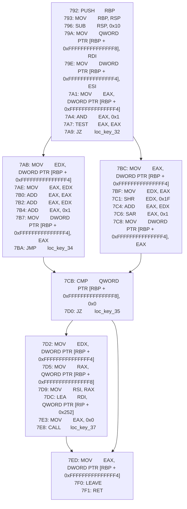
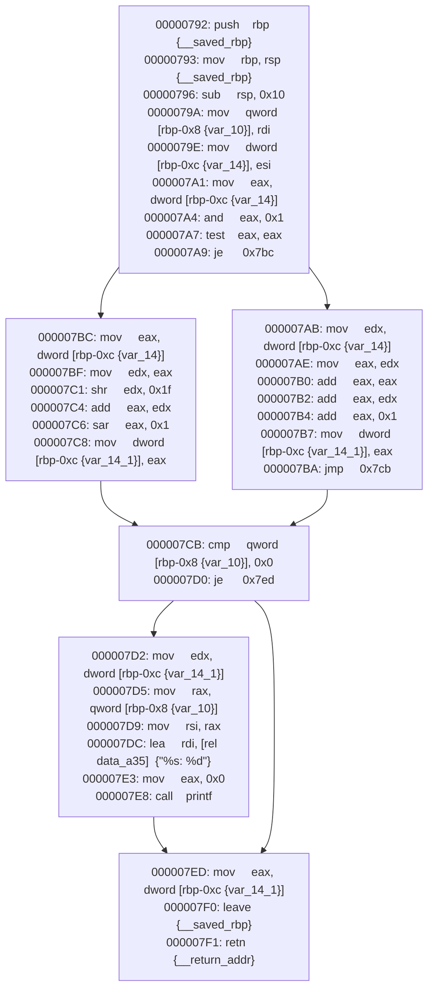

Draw control flow graphs with MIASM, BinaryNinja, and Mermaid.

Since [github announced support for Mermaid](https://github.blog/2022-02-14-include-diagrams-markdown-files-mermaid/), it's now possible to include many types of drawings in issues, pull requests, or anything else that is treated like github-flavored markdown and rendered, including this file.

Here's an output from [./using-miasm.py](./using-miasm.py):



Here's an output from [./using-binja.py](./using-binja.py):



## Notes

```
Miasm:

AsmCFG
  miasm.core.asmblock.AsmCFG
    .nodes() returns set of LocKey
    .edges() returns list of (LocKey, LocKey) tuples
    .blocks is dict_values of AsmBlock
    .getby_offset()
    .loc_key_to_block()

AsmBlock
  miasm.core.asmblock.AsmBlock
    .lines is list of instruction_x86 object

instruction\_x86
  miasm.arch.x86.arch.instruction\_x86
    .offset

LocKey
  miasm.expression.expression.LocKey
    .key is an int

Mermaid Notes:

- is not like DOT
- newlines with &lt;br&gt;
- label delimeters control vertex shape, like A[Hello] makes a box, A(Hello) makes a box with rounded corners, A{Hello} makes a diamond
```
