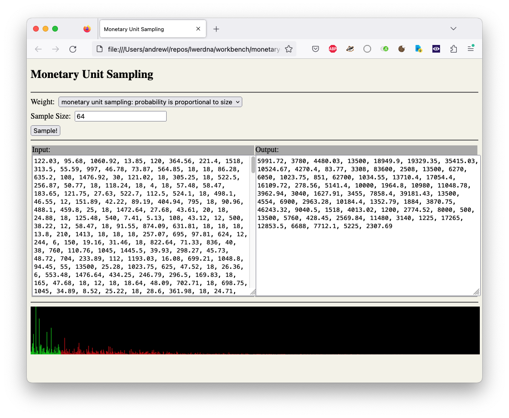

Example data processing application in javascript (monetary unit sampling).

It treats every value like a raffle contestant. Each value buys its own number of tickets. A value like \$1000 holds ten times more tickets than a value like \$100.
