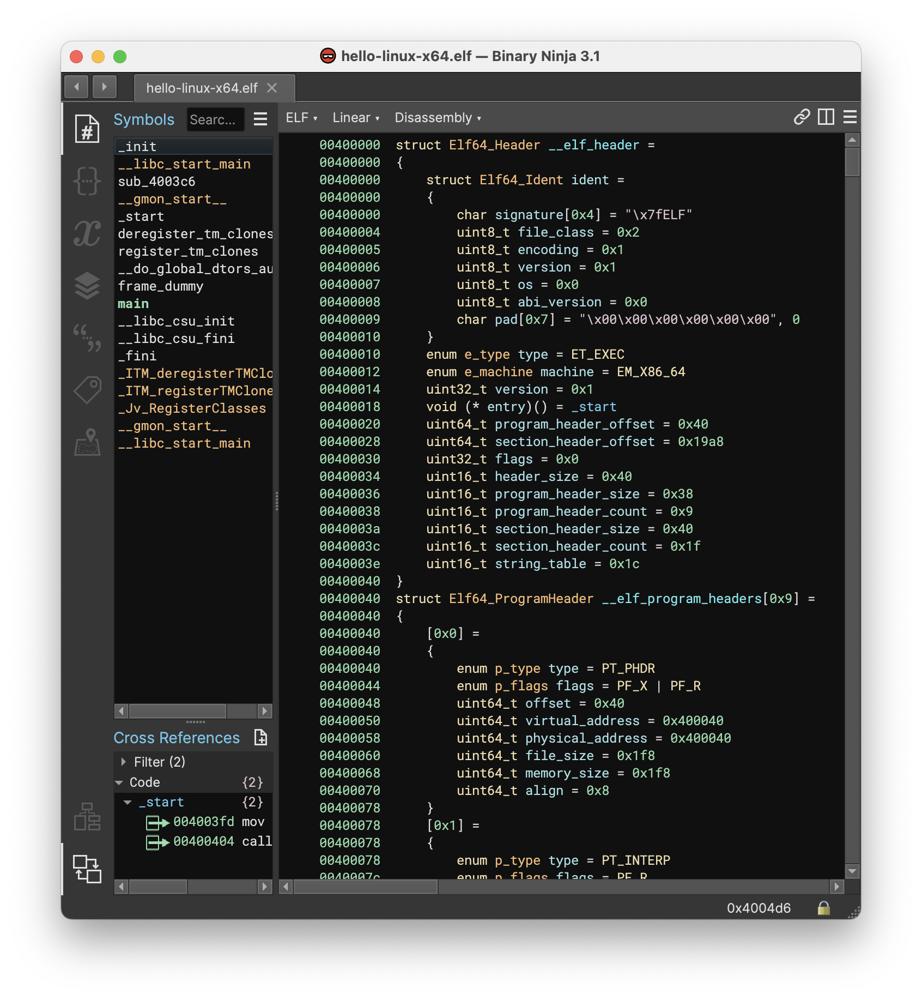
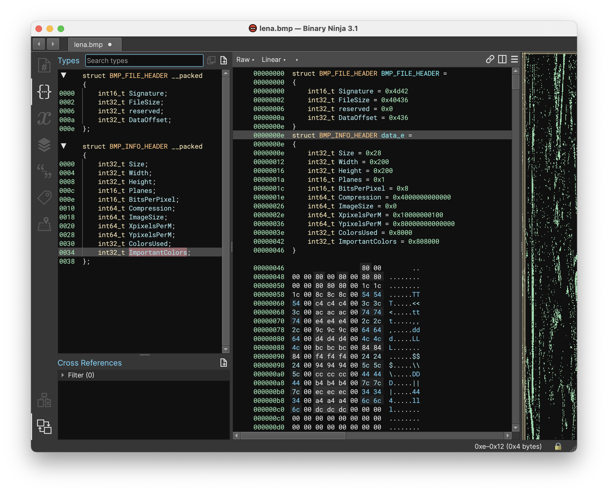
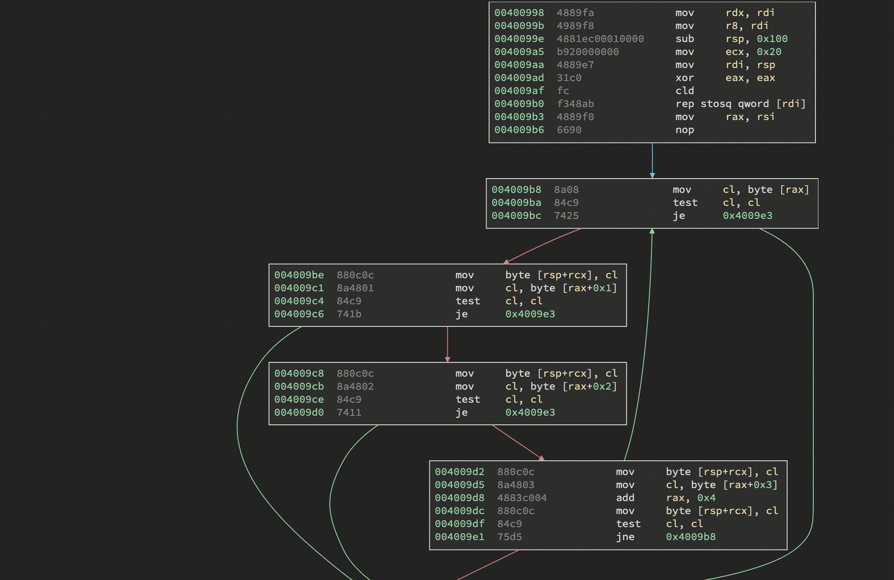
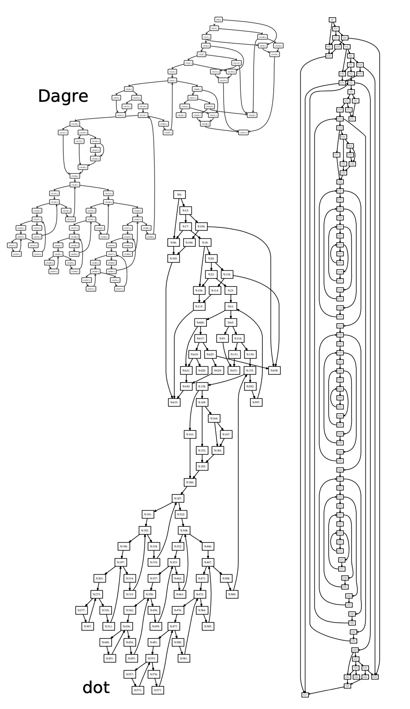
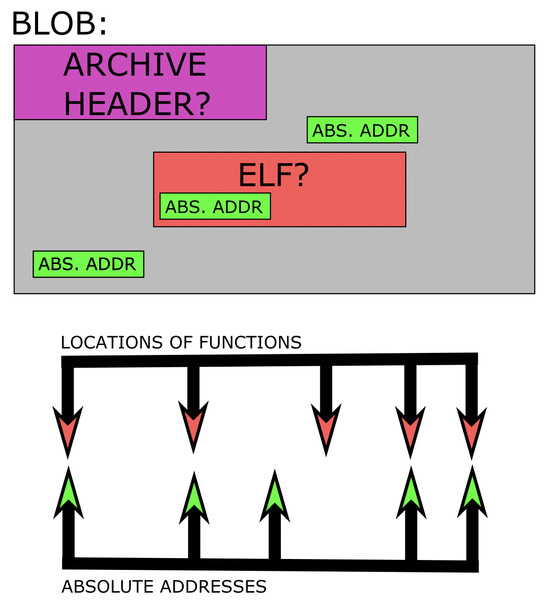
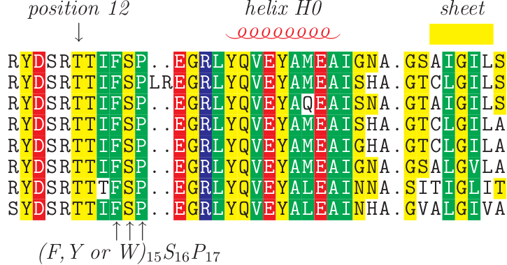
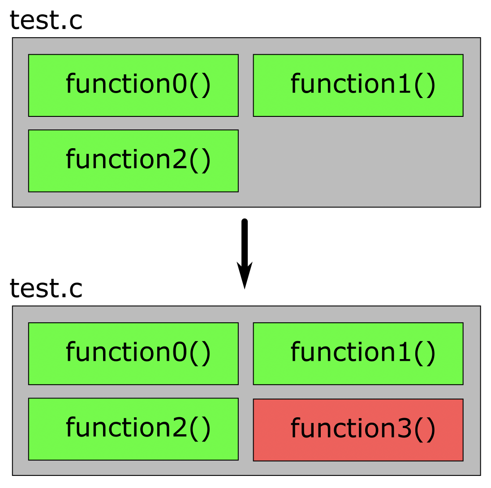
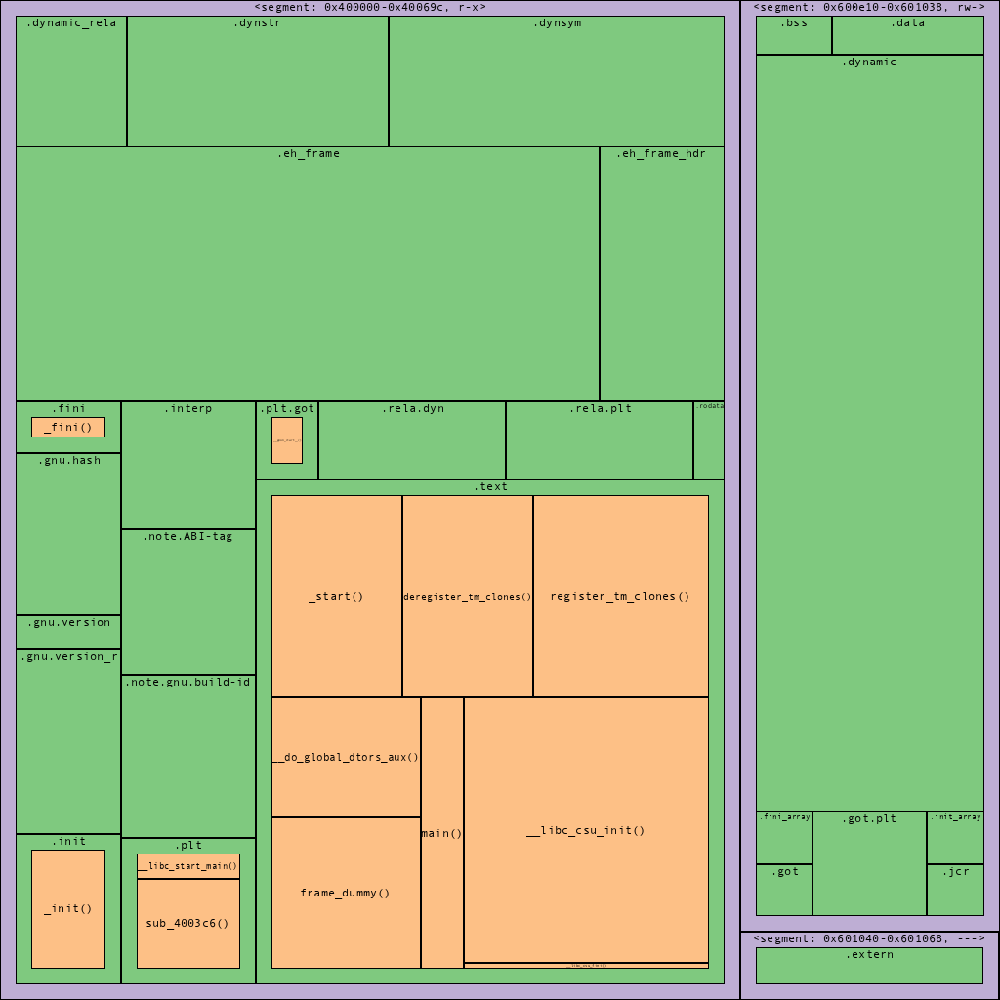
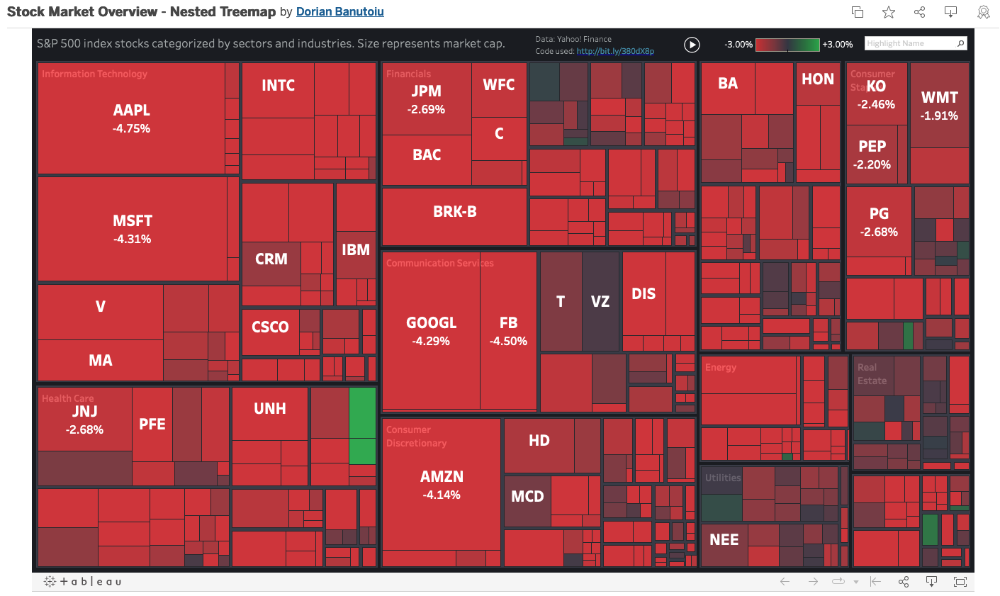

# Native File Format Support Beyond Executables

## - Kaitai is cool, but it's a plugin

## - Another template language? Kind of... Our type system already facilitates this (BinaryView , CreateType(), ApplyType() all glued by python)

## - Imagine a public repo of supported formats

# The Ability to Register As A Graph Layout Provider

## - User could install a plugin for graphviz, networkx, dagre, CFGExplorer, etc.

## - What about other abilities to mark on the canvas? Could someone doing program analysis use this?

## - Point, click, drag blocks?

# Plugin Needed: Binwalk

## Plugin or native? "It looks like the blob you opened consists of parts we usually process individually..."

## Last user study had this issue and would have benefited greatly

# Feature Needed:  Base Address Suggester

## Binwalk just identifies the location of blob components, but this would be a welcome step further...

## Any other ideas for base address suggesting?

# How well would edit distance or minimum alignment work on function matching with IL's?

## - We know it doesn't work so well on assembler opcodes (equivalent behavior but very different instructions, reordering, etc.)

## - But might our ILs, at some level, provide sufficient normalizaton that the technique becomes viable again?

# Feature Needed: Migrate .BNDB

## Much work went into firmware1.0.bndb, but now firmware2.0.bndb is out!
## How to avoid repeating work in the second listing?
## Ok, it's tough, but can't we at least do well at the easiest scenario? (Rafael's)

# Our default view should be graphical, and I suggest a treemap

## User is immediately oriented. "Oh this is a large file", "Oh this is mostly code/data"
## What will most users want to navigate to? main()? strings? High entropy areas? We could put homing beacon animations on these spots
## Imagine cells for functions popping into existence as they are found by analysis
## Imagine the areas allocated for functions color transitioning as analysis completes
## User is immediately orien