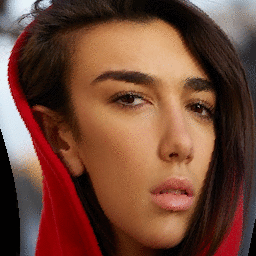

This excursion started when I saw this avatar from a forum:


Imagining just the dots, it feels like they're on fabric, and I wonder if this is related to the effect where some logo is made to look like it's on a flag blowing in the wind.

The circles reveal the trick of the illusion: it's identically rotating dots, just at difference phases.

Here it is in pico-8:


Extending now, more points with the underlying "arms" (radii) drawn in. Note that the "arms" can overlap the path of the other arms.


Horizontally, I want the leftmost and rightmost dots to differ in phase by 90 degrees. So for 128 pixel width, the start angle is `(x/128)*90`. For a more dynamic flag flap, the phase difference between vertical dots can be different than horizontal:


Now it looks like ping pong balls on the top of water. It reminds me of the top scores and programmer credits screen from the Hydro Thunder arcade game.

There's room to embellish now. At each point a ball is drawn using `circfill()` then `line()` to its east and south neighbor's position. A smaller `circfill()` at the center covers the joint of the lines. Another white `circfill()` at the NW fakes a light's reflection ( specular).


I could be tricked into thinking there's a force-spring system being modelled here!

A `polyfill()` call for each of the rhombuses, creates a cool wiggly checkerboard. Here, instead, it's inefficiently achieved by looping over all 128x128 pixels, and calculating where the tip of the arm (radius) would be on a chessboard. Depending on whether it lands on a black or white square, `pset()` is called with one of two colors:


Same thing here, outside of pico-8. Every location in the output is visited and it's arm is calculated, seeking a location in the source image. If out of bounds, return black:



Playing with angular speeds (here it's faster horizontally and slower vertically) we can realize the flag effect:


Source:

```python
#!/usr/bin/env python

import os, sys, math
from PIL import Image

bgcolor = (0,0,0)
radius = 32
anim_len = 32

im = Image.open(sys.argv[1])
(w,h) = (im.width, im.height)
im = im.convert('RGB')

im2 = Image.new('RGB', (w,h))
im2px = im2.load()

for tick in range(anim_len):
	for y in range(h):
		for x in range(w):
			angle = (1.0*x/w)*(1/3.0)*2*math.pi
			angle += (1.0*y/h)*(1/2.0)*2*math.pi
			angle += (1.0*tick/anim_len)*2*math.pi
	
			xseek = x + radius*math.cos(angle)
			yseek = y + radius*math.sin(angle)
			if xseek<0 or xseek>=w or yseek<0 or yseek>=h:
				im2px[x,y] = bgcolor
			else:
				im2px[x,y] = im.getpixel((xseek,yseek))

	fname = '/tmp/tmp_%04d.png' % tick
	print 'saving %s' % fname
	im2.save(fname)

os.system('convert -delay 2 /tmp/tmp_*.png -loop 0 /tmp/tmp.gif')
```

Quick aside: pico-8 allows you to specify the time (in seconds) to save to a gif. To get a perfect loop, your animation either needs to repeat on a boundary of one second or you can use extract frames from an over sampled gif using imagemagick: `convert foo.gif[0-31] bar.gif`
