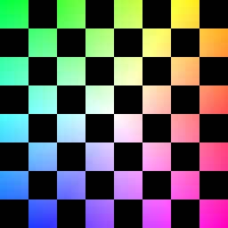
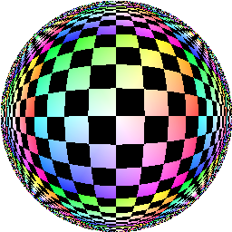
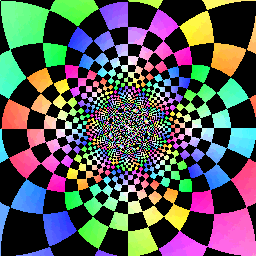
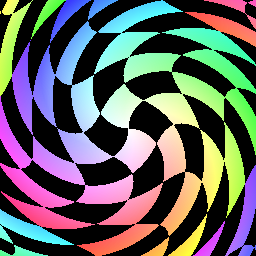
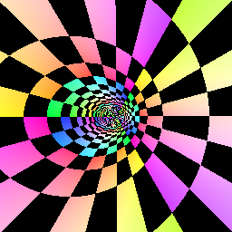
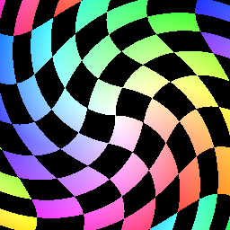
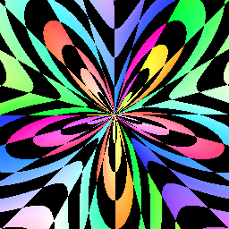
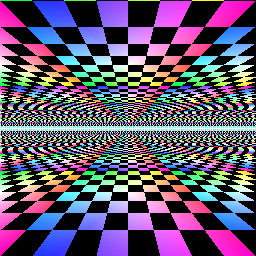
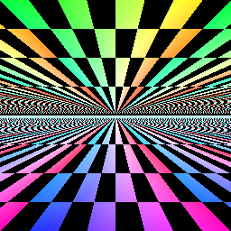

Make cool graphical effects with relatively simple plane mappings.

I learned you can get many impressive looking 3d effects just by cleverly mapping pixels from a source image ("texture") to a new image. If you vary the mapping over time, you can even have it animate, like the classic tunnel effect.

This texture was generated ([./gen_chess_256.py](./gen_chess_256.py)) to help see where the texture pixels end up:



In the following examples (all but one from [iquilezles.org](http://www.iquilezles.org/www/articles/deform/deform.htm)), image coordinates are normalized to [-1,1] on both axis in Cartesian space. Input variables (x,y) are the Cartesian coordinates and (r,a) are the radius and angle polar coordinates. Output variables (u,v) are the result of the mapping. The final image's pixel value at (x,y) comes from the texture coordinate (u,v) with coordinates wrapping around N-S and E-W.

**Lense** Imagine a half-circle dome laying over the x-y plane. Convert x and y to polar coordinates in the plane and the radius r is then used to find the angle to the dome:

```
dome_a = asin(r)
dome_r = tan(dome_a)
u = dome_r * cos(a)
v = dome_r * sin(a)
```



**Inverse Polar** I love this one. Just map to polar and back again, but use 1/r instead of r:

```
u = (1/r) * cos(a)
v = (1/r) * sin(a)
```

I can't resist animating this one:



**Circular Wavy**

```
u = x*cos(2*r) - y*sin(2*r)
v = y*cos(2*r) + x*sin(2*r)
```



**Tunnel** x's reach is inversely related to r and y's reach is directly related to a. Just `u = 1/r` and `v = a` produce a decent tunnel. The .3, .5, and 3 are nice tweaks, one that moves the end of the tunnel to the left.

```
u = .3/(r+.5*x)
v = 3*a/pi
```



**Circular Wavy #2**

```
u = r*cos(a+r)
v = r*sin(a+r)
```



**Penta Lobe**

```
u = 1/(1/(r+.5+.5*sin(5*a)))
v = a*3/pi
```



**Cave Crawl** Think of abs(y) as verticle displacement from the x axis. Now reaches further out when it's closer to the axis, since it's being divided by abs(y)<0, foreshortening. Same with y.

```
u = x/abs(y)
v = 1/abs(y)
```



If we don't foreshorten y, if we use just `v=y` then checkers in the distance are given the same vertical real estate as nearby checkers, which doesn't look right:



In all mappings, where there is division, I left out the code that ensures the divisor is nonzero.