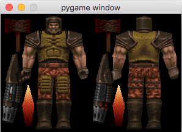

How difficult would it be to get into Quake's game files and render an animated player?

Progress

1. Found quake106.zip and `unzip quake106.zip` to get resource.1, install.bat, deice.exe, resource.dat.
2. Rename resource.1 to resource.lzh and app 'The Unarchiver' to extract it. Note that this file is actually an MS-DOS executable that self extracts, LHA's SFX 2.13L (c) Yoshi, 1991, cool!
3. Despite being the simplest format so far, 'The Unarchiver' is unable to unpack ID1/PAK0.PAK, use included unpak.py.
4. Player model and skin is in ./resource/ID1/progs/player.mdl

This isn't very organized, oh well:

* colormap.py generates an html document with all the colors in a table
* colormap.html is the table
* showskin.py renders the skin in player.mdl to a pygame window

References:

* http://tfc.duke.free.fr/coding/mdl-specs-en.html
* http://pnahratow.github.io/creating-models-for-quake-1.html
* http://www.delorie.com/djgpp/doc/exe/

* http://www.fileformat.info/format/exe/corion-mz.htm