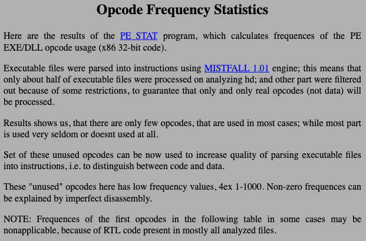

Binary Ninja Devs @BinjaDevs · Aug 13, 2019
porting Z0MBiE's opcode frequency tool PESTAT https://buff.ly/31vL8xC to 25 lines of python+binja and running it on busybox binaries: https://buff.ly/33zCbFo - register moves top the frequency in all architectures

