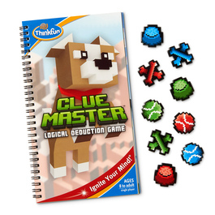
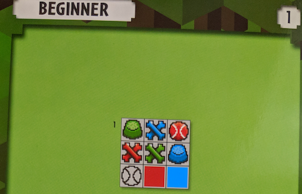
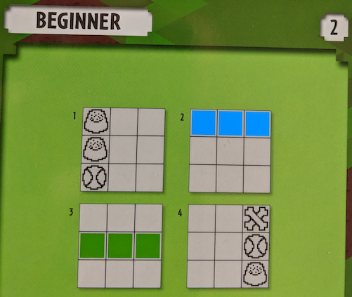
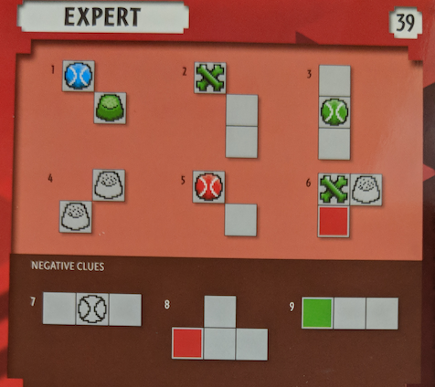
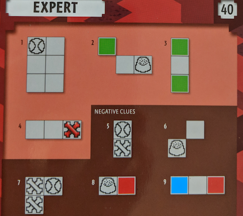

# Thinkfun's "Clue Master" in Z3

I'm learning Z3 and thought this kid's game could serve as a good exercise and fundamental example:



It's easy to identify as a [constraint satisfaction problem](https://en.wikipedia.org/wiki/Constraint_satisfaction_problem). Nine variables exist corresponding to the nine positions on the solutions board. The domain of the variables are the nine pieces. The variables must be distinct. The remainder of the constraints are give in the per-puzzle clues.

Formally:

X = {p1, p2, p3, p4, p5, p6, p7, p8, p9} is the set of variables

D = {{RedBall, GreenBall, BlueBall, RedBone, GreenBone, BlueBone, RedBowl, GreenBowl, BlueBowl}, ...} is the set of respective domains

C = {"all X are distinct", "&lt;clue1&gt;", "&lt;clue2&gt;", ..., "&lt;clueN&gt;"}} is the set of constraints

This code is common to all puzzles:

```lisp
(declare-datatypes () ((Item RedBall RedBowl RedBone GreenBall GreenBowl GreenBone BlueBall BlueBowl BlueBone)))
(declare-const p1 Item)
(declare-const p2 Item)
(declare-const p3 Item)
(declare-const p4 Item)
(declare-const p5 Item)
(declare-const p6 Item)
(declare-const p7 Item)
(declare-const p8 Item)
(declare-const p9 Item)

; color checks
(define-fun IsRed ((x Item)) Bool (or (= x RedBall) (= x RedBowl) (= x RedBone)))
(define-fun IsGreen ((x Item)) Bool (or (= x GreenBall) (= x GreenBowl) (= x GreenBone)))
(define-fun IsBlue ((x Item)) Bool (or (= x BlueBall) (= x BlueBowl) (= x BlueBone)))

; item checks
(define-fun IsBall ((x Item)) Bool (or (= x RedBall) (= x GreenBall) (= x BlueBall)))
(define-fun IsBowl ((x Item)) Bool (or (= x RedBowl) (= x GreenBowl) (= x BlueBowl)))
(define-fun IsBone ((x Item)) Bool (or (= x RedBone) (= x GreenBone) (= x BlueBone)))

(assert (distinct p1 p2 p3 p4 p5 p6 p7 p8 p9))
```

And now the clue code for each puzzle, and solution:

### Beginner #1



```lisp
; clue #1
(assert (IsBowl p1))
(assert (IsGreen p1))

(assert (IsBone p2))
(assert (IsBlue p2))

(assert (IsBall p3))
(assert (IsRed p3))

(assert (IsBone p4))
(assert (IsRed p4))

(assert (IsBone p5))
(assert (IsGreen p5))

(assert (IsBowl p6))
(assert (IsBlue p6))

(assert (IsBall p7))

(assert (IsRed p8))

(assert (IsBlue p9))

(check-sat)
(get-model)
```

With solution:

```bash
$ z3 ./clue_master_beginner_1.smt
sat
(model
  (define-fun p7 () Item
    GreenBall)
  (define-fun p1 () Item
    GreenBowl)
  (define-fun p2 () Item
    BlueBone)
  (define-fun p4 () Item
    RedBone)
  (define-fun p3 () Item
    RedBall)
  (define-fun p8 () Item
    RedBowl)
  (define-fun p9 () Item
    BlueBall)
  (define-fun p5 () Item
    GreenBone)
  (define-fun p6 () Item
    BlueBowl)
)
```

### Beginner #2



```lisp
; clue #1
(assert (IsBowl p1))
(assert (IsBowl p4))
(assert (IsBall p7))

; clue #2
(assert (IsBlue p1))
(assert (IsBlue p2))
(assert (IsBlue p3))

; clue #3
(assert (IsGreen p4))
(assert (IsGreen p5))
(assert (IsGreen p6))

; clue #4
(assert (IsBone p3))
(assert (IsBall p6))
(assert (IsBowl p9))

(check-sat)
(get-model)
```
With solution:

```bash
$ z3 ./clue_master_beginner_2.smt
sat
(model
  (define-fun p7 () Item
    RedBall)
  (define-fun p1 () Item
    BlueBowl)
  (define-fun p2 () Item
    BlueBall)
  (define-fun p4 () Item
    GreenBowl)
  (define-fun p3 () Item
    BlueBone)
  (define-fun p8 () Item
    RedBone)
  (define-fun p9 () Item
    RedBowl)
  (define-fun p5 () Item
    GreenBone)
  (define-fun p6 () Item
    GreenBall)
)
```

### Expert #39



```lisp
; clue #1
(assert (or 
	(and (IsBlue p1) (IsBall p1) (IsGreen p5) (IsBowl p5))
	(and (IsBlue p2) (IsBall p2) (IsGreen p6) (IsBowl p6))
	(and (IsBlue p4) (IsBall p4) (IsGreen p8) (IsBowl p8))
	(and (IsBlue p5) (IsBall p5) (IsGreen p9) (IsBowl p9))			
))

; clue #2
(assert (or
	(and (IsGreen p1) (IsBone p1))
	(and (IsGreen p2) (IsBone p2))
))

; clue #3
(assert (or
	(and (IsGreen p4) (IsBall p4))
	(and (IsGreen p5) (IsBall p5))
	(and (IsGreen p6) (IsBall p6))
))

; clue #4
(assert (or
	(and (IsBowl p2) (IsBowl p4))
	(and (IsBowl p3) (IsBowl p5))
	(and (IsBowl p5) (IsBowl p7))
	(and (IsBowl p6) (IsBowl p8))
))

; clue #5
(assert (or
	(and (IsRed p1) (IsBall p1))
	(and (IsRed p2) (IsBall p2))
	(and (IsRed p4) (IsBall p4))
	(and (IsRed p5) (IsBall p5))
))

; clue #6
(assert (or
	(and (IsGreen p1) (IsBone p1) (IsBowl p2) (IsRed p4))
	(and (IsGreen p2) (IsBone p2) (IsBowl p3) (IsRed p5))
	(and (IsGreen p4) (IsBone p4) (IsBowl p5) (IsRed p7))
	(and (IsGreen p5) (IsBone p5) (IsBowl p6) (IsRed p8))
))

; clue #7
(assert (not (or
	(IsBall p2)
	(IsBall p5)
	(IsBall p8)
)))

; clue #8
(assert (not (or
	(IsRed p4)
	(IsRed p7)
)))

; clue #9
(assert (not (or
	(IsGreen p1)
	(IsGreen p4)
	(IsGreen p7)
)))

(check-sat)
(get-model)
```

```
$ z3 ./clue_master_expert_39.smt
sat
(model
  (define-fun p7 () Item
    BlueBone)
  (define-fun p1 () Item
    RedBall)
  (define-fun p2 () Item
    GreenBone)
  (define-fun p4 () Item
    BlueBall)
  (define-fun p3 () Item
    BlueBowl)
  (define-fun p8 () Item
    GreenBowl)
  (define-fun p9 () Item
    RedBone)
  (define-fun p5 () Item
    RedBowl)
  (define-fun p6 () Item
    GreenBall)
)
```

### Expert #40



```lisp
; clue #1
(assert (or 
	(IsBall p1)
	(IsBall p2)
))

; clue #2
(assert (or
	(and (IsGreen p1) (IsBowl p6))
	(and (IsGreen p4) (IsBone p9))
))

; clue #3
(assert (or
	(and (IsGreen p1) (IsGreen p3))
	(and (IsGreen p3) (IsGreen p6))
	(and (IsGreen p7) (IsGreen p9))
))

; clue #4
(assert (or
	(and (IsRed p3) (IsBone p3))
	(and (IsRed p6) (IsBone p6))
	(and (IsRed p9) (IsBone p9))
))

; clue #5
(assert (not (or
	(and (IsBall p1) (IsBone p4))
	(and (IsBall p2) (IsBone p5))
	(and (IsBall p3) (IsBone p6))
	(and (IsBall p4) (IsBone p7))
	(and (IsBall p5) (IsBone p8))
	(and (IsBall p6) (IsBone p9))
)))

; clue #6
(assert (not (or
	(IsBowl p4)
	(IsBowl p5)
	(IsBowl p7)
	(IsBowl p8)
)))

; clue #7
(assert (not (or
	(and (IsBone p1) (IsBall p2) (IsBone p4))
	(and (IsBone p2) (IsBall p3) (IsBone p5))
	(and (IsBone p4) (IsBall p5) (IsBone p7))
	(and (IsBone p5) (IsBall p6) (IsBone p8))
)))

; clue #8
(assert (not (or
	(and (IsBowl p1) (IsRed p2))
	(and (IsBowl p2) (IsRed p3))
	(and (IsBowl p4) (IsRed p5))
	(and (IsBowl p5) (IsRed p6))
	(and (IsBowl p7) (IsRed p8))
	(and (IsBowl p8) (IsRed p9))
)))

; clue #9
(assert (not (or
	(and (IsBlue p1) (IsRed p3))
	(and (IsBlue p4) (IsRed p6))
	(and (IsBlue p7) (IsRed p9))
)))

(check-sat)
(get-model)
```

```
$ z3 clue_master_expert_40.smt
sat
(model
  (define-fun p7 () Item
    RedBall)
  (define-fun p1 () Item
    GreenBall)
  (define-fun p2 () Item
    RedBowl)
  (define-fun p4 () Item
    BlueBall)
  (define-fun p3 () Item
    GreenBowl)
  (define-fun p8 () Item
    GreenBone)
  (define-fun p9 () Item
    RedBone)
  (define-fun p5 () Item
    BlueBone)
  (define-fun p6 () Item
    BlueBowl)
)
```
