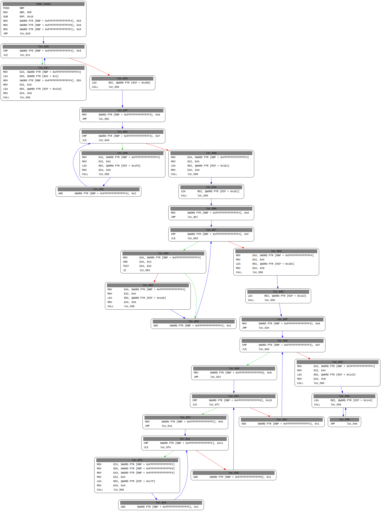

# Playing With Miasm

Miasm is a reverse engineering framework in Python: https://github.com/cea-sec/miasm

## Setup

My experience using python 3.10.0:

```
pip3 install future
```

Then, in files `miasm/core/utils.py` and `miasm/ir/symbexec.py` change:
```
  from collections import MutableMapping as DictMixin
```
to:
```
  from collections.abc import MutableMapping as DictMixin
```

In file `miasm/core/cpu.py` change:
```
  base_expr = pyparsing.operatorPrecedence(operand,
```
to:
```
  base_expr = pyparsing.infixNotation(operand,
```

## Use

`./disasm_file.py <file> <function>`

Will make a graph of the function's CFG in /tmp/tmp.dot, like:



Adjust to taste.

## Useful Links:

https://www.randhome.io/blog/2020/04/04/analyzing-shellcodes-with-miasm-for-fun-and-profit/
https://sudhackar.github.io/blog/learning-symbolic-execution-with-miasm
https://miasm.re/blog/2017/10/05/playing_with_dynamic_symbolic_execution.html
