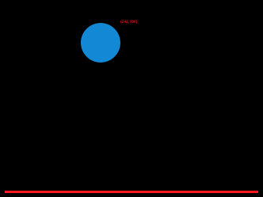
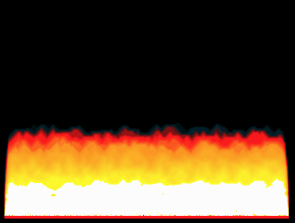
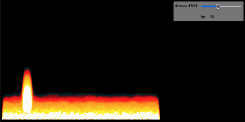
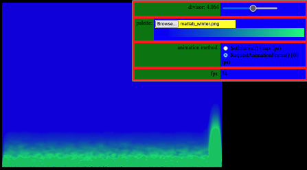
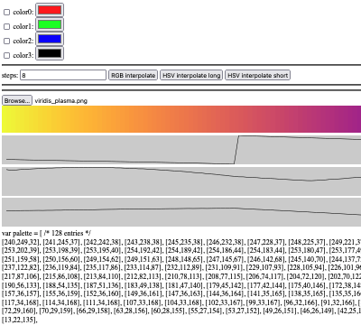
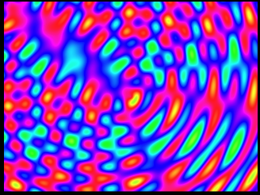
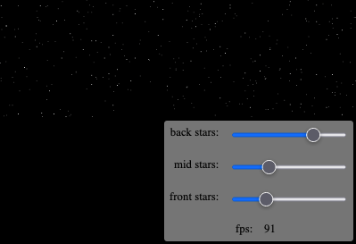
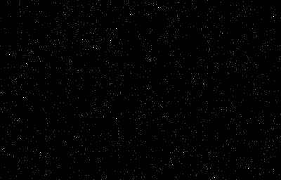

These are some experiments drawing on the HTML5 canvas with javascript circa 2018-07-15.

### ./bouncing_ball

### ./fire

### ./fire_controls

A slider allows you to adjust the fire effect divisor and your mouse cursor can inflame the flames.

### ./fire_controls2

You can load a custom palette and choose between animation methods.

### ./palette

Load images as palettes and display an array of RGB values.

### ./plasma

### ./stars_circular

### ./stars_linear

