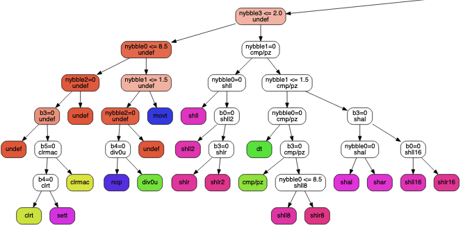

Attempt to generate decision trees for instruction decoding.

**dependencies**: [skoolkit](https://pypi.org/project/skoolkit/) for the z80 disassembler (`pip install skoolkit`) and [scikit-learn](https://pypi.org/project/scikit-learn/) for the AI/ML part

Here's a portion of one of the resulting trees for SuperH:



And the corresponding decision tree in C code is in [sh4_decision_bits_nybbles.c](./sh4_decision_bits_nybbles.c), a snippet:

```C
if(b13 <= 0)
 if(b12 <= 0)
  if(nybble3 <= 10)
   if(b2 <= 0)
    if(b15 <= 0)
     if(b1 <= 0)
      if(nybble1 <= 2)
       if(b14 <= 0)
        if(nybble0 <= 8)
         if(nybble2 <= 0)
          if(b3 <= 0)
           return undef();
          else
           if(b4 <= 0)
            if(nybble1 <= 1)
             return clrt();
            else
             return clrmac();
           else
            return sett();
         else
          return undef();
...
```

At first I used bits as the features, but then added nibbles too. The resulting decision trees are disappointingly large. Dreams of automatically generated disassemblers remain dreams for now.
