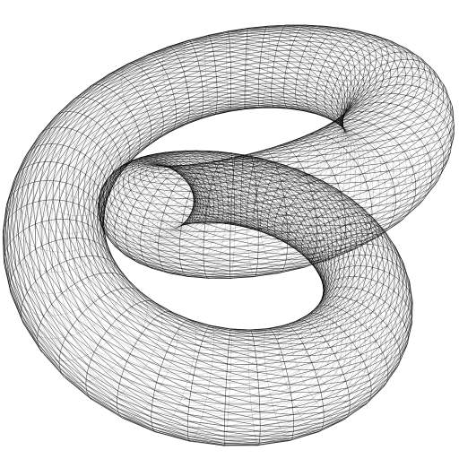
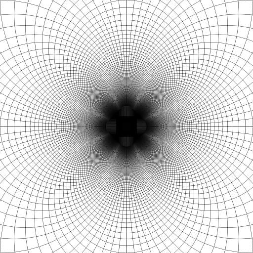
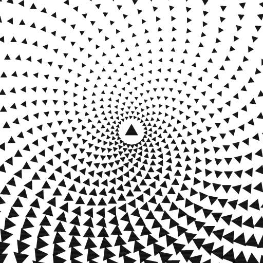
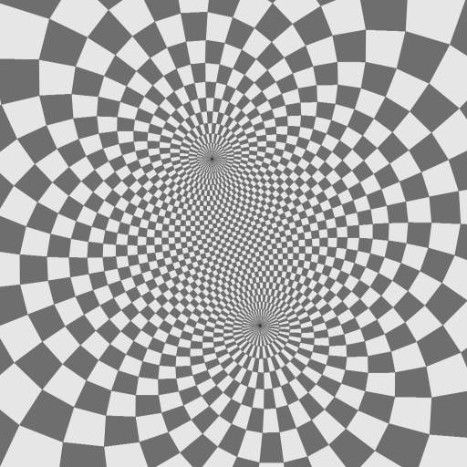
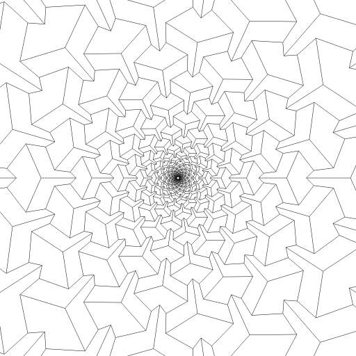

Posted 2019-01-04

https://turtletoy.net/turtle/03d0636fdc
[toroid.js](./toroid.js)

Thanks to flockaroo's torus https://turtletoy.net/turtle/2dc4806767 and the equation from OSX grapher app.

Posted 2019-01-11

https://turtletoy.net/turtle/d5283441b1
[polar_flower.js](./polar_flower.js)

Just cartesian -> polar -> cartesian except r is substituted for 1/r.

Posted 2019-01-24

https://turtletoy.net/turtle/536cfbde49
[spiral_triangles.js](./spiral_triangles.js)

This is an attempt to reproduce an effect from the demo "Intrinsic Gravity" by Still.
The triangles' positions lead your eye towards certain lines while their rotations lead to others.

Posted 2019-01-25

https://turtletoy.net/turtle/8ec8e10a07
[stereographic.js](./stereographic.js)

- had seen pics like these, thought they were interesting
- guessed that they were magnetic fields or something
- actually is mapping from sphere points to a plane: https://en.wikipedia.org/wiki/Stereographic_projection
- long and verbose code, to learn, much more compact implementations exist

Posted 2019-02-08

https://turtletoy.net/turtle/a9cf9e31b3
[many_steps_down.js](./many_steps_down.js)

This is an attempt to fake a still from:
https://twitter.com/beesandbombs/status/880421946659352576.
without anything 3d.

Posted 2020-05-06

That counterspiral pattern in the spiral triangles drawing is sometimes called phyllotactic or phyllotaxis spiral https://en.wikipedia.org/wiki/Phyllotaxis or spiral phyllotaxis.
