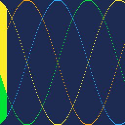
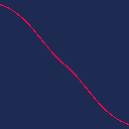

## Twister Effect

On [http://eab.abime.net/showthread.php?t=59865](http://eab.abime.net/showthread.php?t=59865) user StingRay says to create 4 points and connect them when one is "above" the other:



This animation exposes the base technique. By varying the angular speed of the sinusoids with time, we flatten out the curves and give the illusion of twisting and untwisting:


Now check out [@kometbomb's extension](https://twitter.com/kometbomb/status/1027236753902592000):


And the amazingly short code (a "tweetcart", the lua portion of a pico-8 cartridge that can fit in a tweet):

```lua
::_::cls(1)x,y,g,z=0,0,t()/5,cos for i=0,1,.005 do a=z(g/7+i/5)/3*z(i/9+g)q=z(a)w=sin(a) x+=q/2 y+=w/2 for j=-1,1,2 do for k=9,12 do o=k/4+g+i*j*z(g/3)s=16*z(o)b=16*z(o+.25) if(s>b)for d=0,1 do line(64+x-w*s,64+y+q*s+d,64+x-w*b,64+y+q*b+d,k)end end x=-x y=-y end end flip()goto _
```

The outer curve (variables a,q,x,y) seems to govern the deformation of the twister line:



Full deobfuscation gets tough. The iterative use of sinusoids (vs. it being a typical x-y graph of a curve) to build the deformation line seem mixed with the four sinusoids needed in the base twister. Here's my best attempt:

```lua
vtime = 0
::start::
cls(1)
x,y=0,0
for i=0,1,.005 do
	vtime += .0003
	a = cos( vtime/35 + i/5 )/3 * cos(vtime/5 + i/9)
	q = cos( a )
	x += q/2
	y += sin(a)/2
   
	for j=-1,1,2 do
		for color=9,12 do
			o = color/4 + (vtime/5) + i*j*cos(vtime/15)

			s=16*cos(o)
			b=16*cos(o+.25)
			
			-- the fill 	
			if(s>b)	then
				-- fill in both directions (else some stray pixels)
				for d=0,1 do
				 x0_ = -sin(a)*s
				 y0_ = q*s+d

				 x1_ = -sin(a)*b
				 y1_ = q*b+d

				 line(64+x+x0_, 64+y+y0_, 64+x+x1_,64+y+y1_,color)
				end
			end
		end
		x=-x
		y=-y
	end
end

flip()
goto start
```