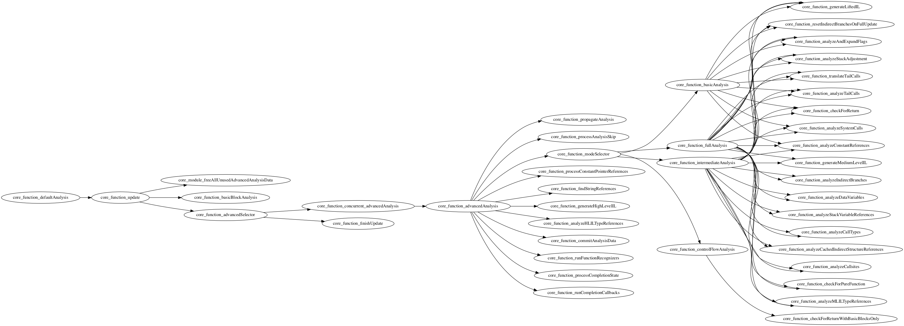

What are Binary Ninja workflows? They're also called "Analysis Orchestration Framework" in the settings.

In layman's terms, it's a way to hook and instrument the analysis pipeline of binja.

[./test0.py](./test0.py) - register a workflow that prints "Hello" during basic block analysis
[./test1.py](./test1.py) - graph the workflow topology
[./topology.png](./topology.png) - resulting graph from test1.py
[./test2.py](./test2.py) - workflow that prints "Hello" after IL is lifted (at "resetIndirectBranchesOnFullUpdate")
[./test3.py](./test3.py) - generate c++ so every single point in the workflow system is hooked
[./fullhook](./fullhook) - the generated workflow that prints at every location possible in the workflow system

I expected the pipeline to be something like `stage1 -> stage2 -> stage3` but instead you get this tree-like structure:

