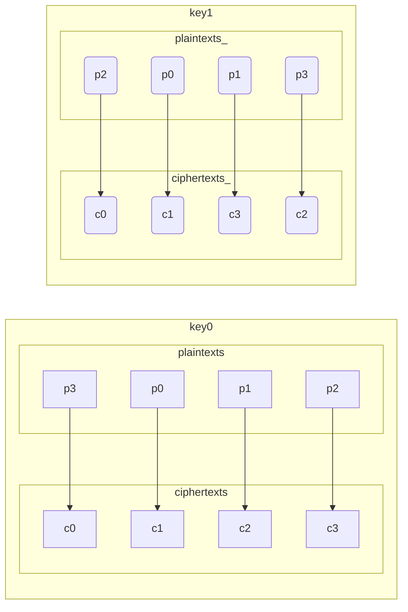

What happens when you try to z3 solve a block cipher like [XTEA](https://en.wikipedia.org/wiki/XTEA)?

Specifically, if we supply plaintext/ciphertext pairs, could z3 solve for the key? This is known as the [Known-plaintext attack (KPA)](https://en.wikipedia.org/wiki/Known-plaintext_attack) scenario or [attack model](https://en.wikipedia.org/wiki/Attack_model).

Obviously this won't work, otherwise block ciphers wouldn't still be in use, but I wonder at what point does it not work, or what makes it not work? Would it work if the cipher were weakened to 1 cycle instead of the 32? If so, 2? 3? How many?

## Test Case

I use this instance from a set of test vectors (see [./xtea_tests.c](./xtea_tests.c)):

plaintext: 0x00112233 0x44556677
ciphertext: 0xd9a4f870, 0xba1f45d6
key: 0x00010203, 0x04050607, 0x08090A0B, 0x0C0D0E0F

This is with all 32 cycles (64 Feistel rounds).

## 1 Cycle Attack: Success

After 1 cycle (2 Feistel rounds) we have ciphertext 0x8BDC52EC, 0x3391FF02

Program [./solve1.py](./solve1.py) finds very quickly the correct key:
```
key0: 0x00010203
key3: 0x0C0D0E0F
```

Note the 2nd (key1) and 3rd (key2) are not scheduled in the first round.

## 2 Cycle Attack: semi-success

After 2 cycles (4 Feistel rounds) we expect ciphertext 0x5A055406, 0xEC8F42BD

Program [./solve2.py](./solve2.py) finds this key:

```
key0: 0xF01CC7A1
key1: 0x11CFB83B
key2: 0x43C28C0D
key3: 0x7400D76C
```

That's not right. Is z3 wrong? No:

```C
	uint32_t key_alt[4] = {0xF01CC7A1, 0x11CFB83B, 0x43C28C0D, 0x7400D76C};
	xtea_encipher_n(2, ptext, key_alt, ctext);
	printf("2cycle' ctext[0]: 0x%08X\n", ctext[0]);
	printf("2cycle' ctext[1]: 0x%08X\n", ctext[1]);
```

Which verifies. In summary we have several keys encrypting 00112233-44556677 to the second cycle output 5A055406-EC8F42BD:

```
xtea2(00112233-44556677, 00010203-04050607-08090A0B-0C0D0E0F) -> 5A055406-EC8F42BD
xtea2(00112233-44556677, F01CC7A1-11CFB83B-43C28C0D-7400D76C) -> 5A055406-EC8F42BD
xtea2(00112233-44556677, 7020C171-279403E2-95EBF595-2F3BD80F) -> 5A055406-EC8F42BD
```

If we impose that the output from the first cycle is the value from the 1 Cycle Attack, it does find the expected key:

```
key0: 0x00010203
key1: 0x04050607
key2: 0x08090A0B
key3: 0x0C0D0E0F
```

But it doesn't seem we should have to do that.

## Are these duplicate keys?

I thought at first that multiple keys could have duplicate effect. But then I realized I was narrowly focused on **this single plaintext/ciphertext pair** and concluding something about whole enciphering.

In these two simplified models of the enciphering bijection with different keys, p0 maps to c1. That's insufficient to conclude the key is a duplicate because the other mappings are different.



## Can the Keyspace represent all enciphers/deciphers?

Here's another argument. Since the domain and codomain are the same (plaintexts and ciphertexts are just the 64-bit integers) we can think of enciphering as a permutation. There are `(2**64)!` possible permutations, a number I'm not sure can even be written down in base 10.

But there are "only" 2^128 possible keys: 340282366920938463463374607431768211456.

So, it's silly in hindsight to have thought there was a key for every mapping.

## 2 Cycle Attack Revisted: Success

With a single plaintext/ciphertext pair there are seemingly endless keys. We'll constrain it with more encryption examples:

With two pairs:

```
0x00112233, 0x44556677 -> 0x5A055406, 0xEC8F42BD
0xAAAAAAAA, 0xBBBBBBBB -> 0x9BE82231, 0xA67A3F1D
```

There are 9 keys:

```
key: 00010203-04050607-08090A0B-0C0D0E0F
key: 00012322-C205D065-4808FA32-CC0F1E64
key: 00010322-C205F065-4808FA32-CC0D3F64
key: 00612322-1A45D065-CC08FA32-5A301E64
key: 81C0D722-9ADAFF5E-ED917733-DBCC2A01
key: 01C0D722-1ADAFF5E-ED917733-5FCC2A01
key: ED00FA2B-7CDF3153-AB8F4B73-BB698840
key: 85707722-16D6635E-6E61F733-0C1C8F01
key: 05707722-96D6635E-6E61F733-881C8F01
```

With three pairs:

```
0x00112233, 0x44556677 -> 0x5A055406, 0xEC8F42BD
0xAAAAAAAA, 0xBBBBBBBB -> 0x9BE82231, 0xA67A3F1D
```

There is only one key, the expected:

```
key: 00010203-04050607-08090A0B-0C0D0E0F
```

## 4 Cycle Attack

Reference implementation 4 cycles XTEA should yield:

```
xtea4(00112233-44556677, 00010203-04050607-08090A0B-0C0D0E0F) -> 5829E8D9-3503BE9C
```

And again there are seemingly endless keys. Adding another encryption example


