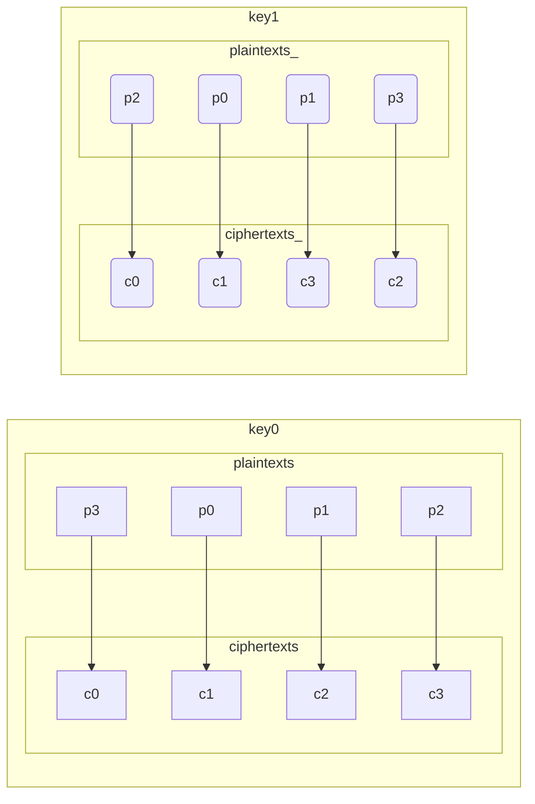

What happens when you try to z3 solve a block cipher like [XTEA](https://en.wikipedia.org/wiki/XTEA)?

Specifically, if we supply plaintext/ciphertext pairs, could z3 solve for the key? This is known as the [Known-plaintext attack (KPA)](https://en.wikipedia.org/wiki/Known-plaintext_attack) scenario or [attack model](https://en.wikipedia.org/wiki/Attack_model).

Obviously this won't work, otherwise block ciphers wouldn't still be in use, but I wonder at what point does it not work, or what makes it not work? Would it work if the cipher were weakened to 1 cycle instead of the 32? If so, 2? 3? How many?

I use this instance from a set of test vectors (see [./xtea_tests.c](./xtea_tests.c)):

**plaintext:** 00112233-44556677
**key**: 00010203-04050607-08090A0B-0C0D0E0F

| cycle | Feistel rounds | ciphertext        |
| ----- | -------------- | ----------------- |
| 1     | 2              | 8BDC52EC-3391FF02 |
| 2     | 4              | 5A055406-EC8F42BD |
| 3     | 6              | 526DBE05-94AC7B54 |
| 4     | 8              | 5829E8D9-3503BE9C |
| ...   | ...            | ...               |
| 32    | 64             | D9A4F870-BA1F45D6 |

[./xtea.c](./xtea.c) calculates these.

## 1 Cycle Attack: Success

[./solve1.py](./solve1.py) finds the key instantly. Note the 2nd (key1) and 3rd (key2) are not scheduled in the first round.

## 2 Cycle Attack: Success

[./solve2.py](./solve2.py) finds many different keys given just the example encryption of 00112233-44556677.

Adding an additional example encryption of AAAAAAA-BBBBBBB constrains the solutions to 9 keys, one of which is our target key.

And adding an additional example encryption of CCCCCCCC-DDDDDDDD constrains the solution to 1 key, our target key.

## 3 Cycle Attack: Failure

[./solve3.py](./solve3.py) with one example plaintext/ciphertext finds many keys.

Adding the additional example AAAAAAAA-BBBBBBB makes it never terminate. I let it run overnight with no success.

## What to think of multiple keys?

Remember to think of block ciphers as a configurable permutation or shuffling, with the configuration encoded in the key:

> For each key $K$, $E_{k}$ is a permutation (a bijective mapping) over the set of input blocks. Each key selects one permutation from the set of $2^n!$ possible permutations.

I mistakenly thought the found multiple keys would cause XTEA to encipher identically for all 64-bit values. But the multiple keys configure for different mappings. They're just mappings that happen to send in particular 00112233-44556677 to 5A055406-EC8F42BD after two rounds. Other inputs are sent to different outputs.

Here's an toy example where two different permutations on 2-bit numbers happen to send p0 to c1:



In full 32-cycle XTEA, can all permutations exist? In other words, is there enough keyspace to represent all possible configurations? There are $2^{64}!$ possible permutations, a number I'm not sure can even be written down in base 10.

But there are "only" $2^{128} = 340282366920938463463374607431768211456$ possible keys.

So no, you cannot even get close to selecting every possible permutation.

## The rapidly increasing size of expressions

When you unroll XTEA's loop you get a series of assignments that's not too bad:

```C
	v0 += (((v1 << 4) ^ (v1 >> 5)) + v1) ^ (0x00000000 + key[0]);
	v1 += (((v0 << 4) ^ (v0 >> 5)) + v0) ^ (0x9E3779B9 + key[3]);
	v0 += (((v1 << 4) ^ (v1 >> 5)) + v1) ^ (0x9E3779B9 + key[1]);
	v1 += (((v0 << 4) ^ (v0 >> 5)) + v0) ^ (0x3C6EF372 + key[2]);
  ...
```

It's only 64 lines long. But since each assignment relies on the previous assignment, you get this telescoping kind of storage of what's actually quite a large expression.

Note that 3 variables appear on the right hand side of each statement. If they were to be replaced by their expression, and they have 3 variables, and so on, then you have a tripling in expression size every time you incorporate a new round. I think a final expression for ciphertext in terms of plaintext and key would be on the order of $3^{64}$ characters, which can't even be written down.

Since the bit operations in each round are interleaved with addition, and there's no algebra between the two, there's no hope of simplifying intermediate results. So the expression just explodes in size. See [./expr-growth.py](./expr-growth.py) for a demonstration.


